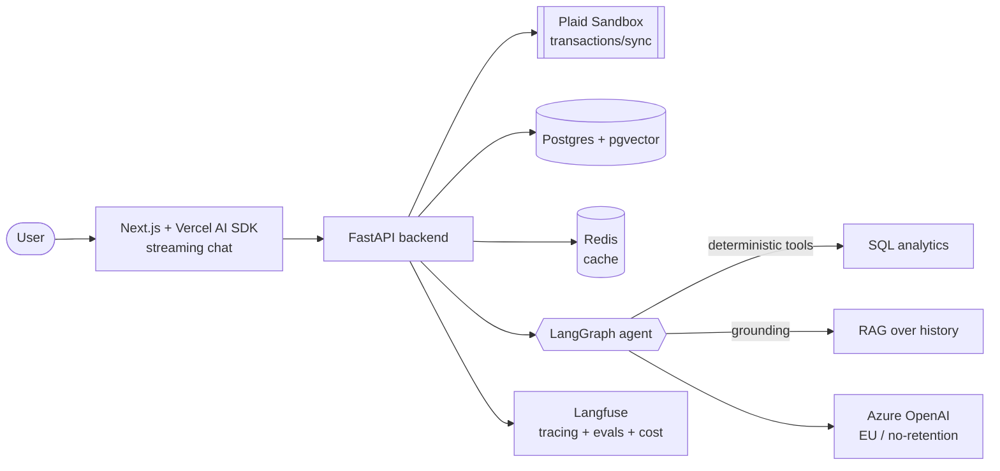

# finsight-ai

> AI-powered personal finance assistant that turns bank transactions into grounded, explainable budgeting insights — built as a production-grade demo on Plaid Sandbox.

**Status:** 🚧 early development (Phase 0 — scaffolding)

`finsight-ai` connects to bank data via **Plaid** (Sandbox), computes spending analytics deterministically in SQL, and uses a **LangGraph agent** to explain trends and surface budgeting insights through a streaming chat UI. It is positioned as **budgeting & financial insights, not licensed financial advice**.

> ⚠️ Educational project. Not financial advice. Runs on Plaid Sandbox data — no real bank accounts.

---

## Why this project

A portfolio-grade AI engineering project that demonstrates the signals hiring teams actually look for: a **live deployed demo**, **RAG over real (messy) data**, an **agentic workflow** with tool calling, **evaluation pipelines** with CI regression gates, **observability**, and **cost/latency awareness**.

## Architecture



**Key design principle:** the LLM never computes money. All sums, trends and cash-flow are calculated in **SQL**; the model only reasons over and explains those facts. This is more accurate, cheaper, and safer.

## Stack

| Layer | Choice |
|---|---|
| Backend | Python, FastAPI (async) |
| Agent | LangGraph, Pydantic structured outputs |
| Frontend | Next.js, Vercel AI SDK, TypeScript |
| Data | Postgres + pgvector, Redis |
| Bank data | Plaid (Sandbox) |
| Billing | Stripe (subscriptions) |
| LLM | Azure OpenAI (EU region, no-retention) |
| Observability | Langfuse (tracing, evals, cost/latency) |
| Infra | Docker, Azure Container Apps, Bicep (IaC) |
| CI/CD | GitHub Actions (build → test → evals gate → deploy) |

## Quickstart (local)

```bash
cp .env.example .env        # fill in sandbox creds
docker compose up --build   # api + postgres + redis
# API:  http://localhost:8000/health
# Docs: http://localhost:8000/docs
```

## Roadmap

- [x] **Phase 0** — Repo scaffold: Docker, FastAPI, Next.js, CI
- [ ] **Phase 1** — Plaid Link + `/transactions/sync` + webhooks + schema
- [ ] **Phase 2** — SQL analytics (categories, trends, cash-flow)
- [ ] **Phase 3** — LangGraph agent + tools + structured output
- [ ] **Phase 4** — Streaming chat UI (Vercel AI SDK)
- [ ] **Phase 5** — Evals + Langfuse + CI regression gate
- [ ] **Phase 6** — Guardrails + PII redaction + security
- [ ] **Phase 7** — Stripe billing (subscriptions)
- [ ] **Phase 8** — Azure Container Apps + Bicep IaC + deploy
- [ ] **Phase 9** — MCP server (expose analytics as tools)
- [ ] **Phase 10** — README, diagrams, polish
- [ ] **Phase 11** — Metrics & ablation (accuracy / latency / cost table)

## Metrics & Ablation

_Populated as components land — measured impact of each part of the pipeline._

| Component | Accuracy | Latency p95 | Cost / query |
|---|---|---|---|
| Baseline (no RAG) | – | – | – |
| + RAG (pgvector) | – | – | – |
| + Reranking | – | – | – |
| + Guardrails / PII | – | – | – |

## License

MIT
