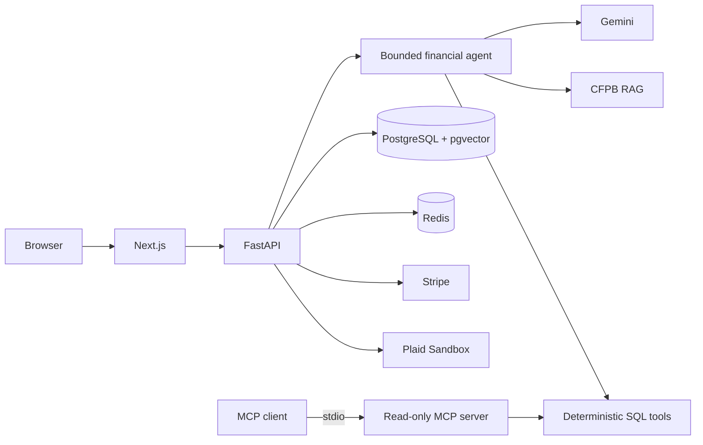

# finsight-ai

Portfolio-grade personal-finance assistant built on Plaid Sandbox. It combines
deterministic SQL analytics with grounded Gemini explanations: the model never
calculates balances or spending totals.

> Educational software, not financial advice. The demo uses synthetic Plaid
> Sandbox data; do not connect real financial accounts.

## What is implemented

- Plaid Link, encrypted access-token storage, account sync, and incremental
  transaction sync.
- User-scoped PostgreSQL analytics for spending, income, net cash flow,
  monthly trends, refunds, and category totals.
- Bounded AI orchestration with only `financial_overview` and
  `knowledge_search` tools, structured outputs, citation validation, and
  progress streaming.
- PostgreSQL-backed, user-scoped conversation history with encrypted titles
  and message content, replayed as bounded, re-redacted multi-turn context.
- CFPB knowledge ingestion with URL allowlisting, heading-aware chunking,
  document hashes, Gemini embeddings, and pgvector HNSW retrieval.
- Bearer JWT authentication, explicit local-only bypasses, admin boundaries,
  PII redaction, Redis rate limiting, and privacy-safe AI telemetry.
- Stripe Checkout, Customer Portal, signed/idempotent webhook processing, and
  subscription state.
- Read-only MCP stdio server and Azure Container Apps Bicep.

## Architecture



See [architecture](docs/architecture.md), [threat model](docs/threat-model.md),
and [demo runbook](docs/demo.md).

## Local setup

Requirements: Docker Desktop, Node.js 22 for direct frontend development, and
Plaid Sandbox plus Gemini API credentials.

```bash
cp .env.example .env
# Fill PLAID_*, GEMINI_API_KEY, and generated local secrets.
docker compose up --build -d
docker compose exec api alembic upgrade head
cd frontend && npm ci && npm run dev
```

If the local firewall blocks package registries, run the
`Offline dependencies` GitHub workflow, download its artifacts into
`backend/.wheels` and `frontend/.npm-offline`, then build the backend with
`PIP_NO_INDEX=1`; the frontend Dockerfile detects and uses the npm cache.

Open `http://localhost:3000`; API docs are at `http://localhost:8000/docs`.
Local auth/admin bypasses are explicit in `.env.example` and are rejected
unless `APP_ENV=local`. Set both bypass flags to `false` outside local
development.

The deployed demo expects an access token issued by its identity boundary.
For an operator-controlled portfolio demo, generate a one-hour token with
`python backend/scripts/generate_demo_jwt.py <user-id>` and paste it into the
UI. A public deployment should replace this operator flow with an OIDC
provider and short-lived tokens.

## Verification

```bash
docker compose exec api sh -lc \
  'ruff check app tests scripts && PYTHONPATH=/app pytest -q && alembic check'
cd frontend && npm run build
docker compose exec api env MCP_USER_ID=local-development-user \
  python -m app.mcp.server
```

Frontend tests run with `npm test`; browser route tests run with
`npm run test:e2e`. Their dependencies and Playwright browser are installed
only by GitHub Actions in environments where package registries are reachable.

The live eval gate uses four routing/grounding cases and requires a `1.0`
score. Provider/quota failures are reported separately from quality failures:

```bash
docker compose exec api python scripts/run_evals.py
```

## Measured evidence

| Signal | Result | Scope |
|---|---:|---|
| Backend tests | 30 passing | auth, analytics, agent, RAG contracts, Stripe, MCP |
| Static eval dataset | 4 cases | analytics, knowledge, combined, unsupported |
| Required live eval score | 100% | available-provider runs only |
| Last successful Gemini latency p95 | 19.63 s | one local free-tier sample |
| Successful token usage | 548 input / 52 output | one local free-tier sample |
| Current live gate | Provider unavailable | Gemini free-tier quota, not scored |

The latency sample is intentionally labeled rather than generalized: one run
is not statistically meaningful. No production cost claim is made because the
current Gemini tier is free and pricing changes independently of this repo.
See [metrics and ablation](docs/metrics.md) for reproducible coverage results.

## Deployment

`infra/azure/main.bicep` provisions Container Apps, PostgreSQL Flexible Server,
an internal demo Redis container, and Log Analytics. Build the frontend image
with `NEXT_PUBLIC_API_URL` set to the deployed API URL. Run Alembic as a
one-shot release step before shifting traffic. The included Redis topology is
single-replica and intended for a portfolio/demo footprint; replace it with a
managed Redis service for production availability.

## Design constraints

- Monetary values remain `Decimal` and come from SQL, never LLM arithmetic.
- Analytics periods are half-open: `[start, end_exclusive)`.
- Transfers and loan payments are excluded from spending/income; refunds
  reduce spending.
- RAG content is untrusted context and only allowlisted admin ingestion can
  mutate it.
- Telemetry stores HMAC fingerprints, not raw questions or user IDs.
- Conversation titles and messages are encrypted at rest and decrypted only
  after tenant ownership checks. Stored messages are kept verbatim (not
  PII-redacted); redaction is applied only to data sent to Gemini. History is
  retained indefinitely and has no deletion endpoint yet — see the threat
  model before production use.
- Plaid access tokens and application secrets must never enter source control.

## License

MIT
