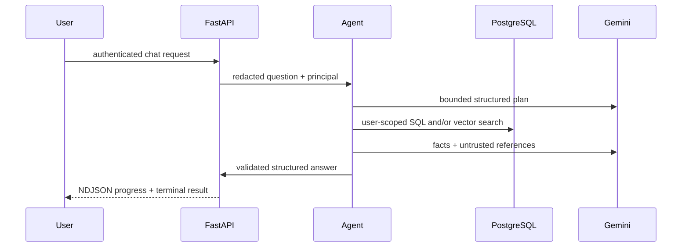

# Architecture

## Request flow

The browser obtains Plaid Link tokens and sends chat requests to FastAPI.
Authentication resolves a stable server-side principal; callers never provide
the analytics tenant ID. Plaid items, accounts, transactions, billing state,
conversation history, and AI telemetry are scoped to that principal.

For chat, a structured Gemini planner selects from two capabilities:
`financial_overview` and `knowledge_search`. The first runs fixed SQL queries;
the second embeds the redacted question and searches approved CFPB chunks.
The final structured response may cite only analytics or retrieved chunk IDs.
The server validates citations before returning the response.

## Data boundaries

Plaid access tokens, conversation titles, and chat messages are
Fernet-encrypted at rest. Conversation ownership is checked before encrypted
content is decrypted. Financial amounts use `NUMERIC(19,4)` and `Decimal`.
Knowledge embeddings use
`gemini-embedding-001` at 768 dimensions with an HNSW cosine index. AI run
records contain HMAC fingerprints, tool names, token counts, latency, and
status, but no raw prompt.

Stripe is the source of truth for subscription lifecycle. Signed webhook
events update a local projection inside the same transaction that records the
event ID, making retries idempotent.

## Deliberate choices

The agent is an explicit state machine rather than LangGraph because this
workflow has no durable pause, branching recovery, or human-in-the-loop state.
Streaming exposes lifecycle progress rather than unvalidated model tokens, so
users never see text that later fails citation validation.

The MCP process exposes one read-only, fixed-schema analytics tool. Its user ID
comes from trusted process configuration, not MCP tool arguments, preventing
cross-tenant selection by a client.
